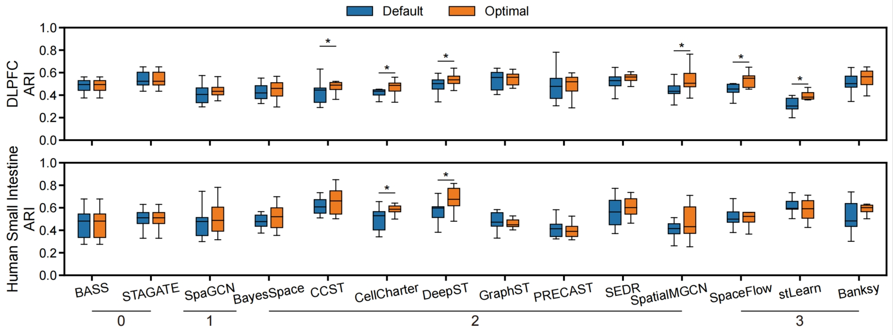

# SRTBenchmark
**Benchmarking spatial clustering methods for spatially resolved transcriptomics**

## Datasets and Methods
Please refer to **[Table1](./Table1_Dataset.xlsx)** for dataset details and the **[Methods](./Methods)** folder for example code of each clustering method.

## Overall Performance
We conducted a comprehensive benchmark of **14 spatial clustering methods** across multiple **technologies, organs, and biological replicates**, and provided **method recommendations** tailored to different application scenarios.

| Technology | Organ          | Replicates | Recommendation (top 5)                         |
|------------|----------------|------------|------------------------------------------------|
| ST         | Brain          | No         | BASS, BayesSpace, PRECAST, CCST, stLearn       |
| 10× Visium | Brain          | No         | STAGATE, GraphST, SEDR, Banksy, DeepST         |
| Slide-seq  | Brain          | No         | STAGATE, SpaGCN, BASS, CCST, SpaceFlow         |
| Stereo-seq | Brain          | No         | BASS, SpaGCN, stLearn, STAGATE, SpatialMGCN    |
| seqFISH+   | Brain          | No         | PRECAST, BASS, stLearn, CellCharter, SpaGCN    |
| STARmap    | Brain          | No         | BASS, stLearn, Banksy, PRECAST, CellCharter    |
| MERFISH    | Brain          | No         | BASS, stLearn, SpatialMGCN, PRECAST, Banksy    |
| CosMx      | Brain          | No         | BASS, Banksy, SEDR, DeepST, CellCharter        |
| Xenium     | Brain          | No         | GraphST, SpaceFlow, BASS, STAGATE, Banksy      |
| 10× Visium | Breast         | No         | stLearn, PRECAST, BayesSpace, SpaGCN, STAGATE  |
| 10× Visium | Heart          | No         | stLearn, BASS, PRECAST, GraphST, STAGATE       |
| 10× Visium | Intestine      | No         | CCST, DeepST, CellCharter, stLearn, STAGATE    |
| 10× Visium | Liver          | No         | STAGATE, PRECAST, stLearn, SpatialMGCN, DeepST |
| 10× Visium | Lung           | No         | PRECAST, stLearn, GraphST, STAGATE, BayesSpace |
| 10x Visium | Brain          | Yes        | DeepST, Banksy, SEDR, GraphST, STAGATE         |
| MERFISH    | Brain          | Yes        | BASS, stLearn, SpaGCN, PRECAST, Banksy         |

## Optimal Preprocessing Pipelines
We tested our optimized preprocessing pipeline on the **10x Visium DLPFC** dataset to improve clustering accuracy.  
To facilitate use of this optimized pipeline, we also provide versions of the methods using the optimized pipelines in the **Methods** folder.

| Method        | Normalization | Log Transformation | Genes Selection | Standardization | Dimension Reduction |
|---------------|---------------|-----------------|----------------|----------------|------------------|
| BASS          | Yes           | Yes             | 3000 SVGs      | No             | 20 PCs           |
| Banksy        | Yes           | Yes             | 3000 SVGs      | Yes            | 15 PCs           |
| BayesSpace    | Yes           | Yes             | 5000 HVGs      | No             | 20 PCs           |
| CCST          | Yes           | No              | 2000 HVGs      | Yes            | 50 PCs           |
| CellCharter   | Yes           | No              | 2000 HVGs      | No             | No               |
| DeepST        | Yes           | Yes             | 3000 SVGs      | Yes            | 50 PCs           |
| GraphST       | Yes           | Yes             | 2000 HVGs      | No             | No               |
| PRECAST       | Yes           | No              | 5000 HVGs      | No             | 20 PCs           |
| SEDR          | Yes           | No              | 3000 SVGs      | Yes            | 50 PCs           |
| STAGATE       | Yes           | Yes             | 3000 HVGs      | No             | No               |
| SpaGCN        | Yes           | Yes             | All Genes      | Yes            | No               |
| SpaceFlow     | Yes           | No              | 3000 SVGs      | Yes            | No               |
| SpatialMGCN   | Yes           | No              | 3000 SVGs      | No             | No               |
| stLearn       | Yes           | No              | 3000 SVGs      | No             | 20 PCs           |

