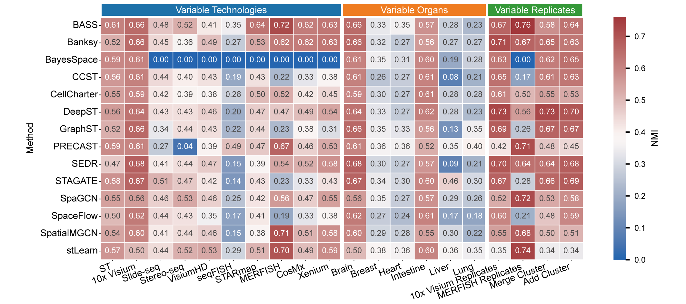

# SRTBenchmark
**Benchmarking spatial clustering methods for spatially resolved transcriptomics**

## Datasets and Methods
Please refer to **Table1** for dataset details and the **Methods** folder for example code of each clustering method.

## Overall Performance
We conducted a comprehensive benchmark of **14 spatial clustering methods** across multiple **technologies, organs, and biological replicates**, and provided **method recommendations** tailored to different application scenarios.

| Technology      | Organ          | Replicates | Recommendation (top 5)                         |
|-----------------|----------------|------------|------------------------------------------------|
| High Resolution | Brain          | No         | BASS, stLearn, Banksy, SpaGCN, STAGATE       |
| Low Resolution  | Brain          | No         | STAGATE, GraphST, SEDR, BASS, BayesSpace     |
| 10x Visium      | High continuity| No         | STAGATE, DeepST, SEDR, CCST, GraphST         |
| 10x Visium      | Low continuity | No         | PRECAST, stLearn, STAGATE, SpaGCN, BayesSpace|
| 10x Visium      | Brain          | Yes        | DeepST, Banksy, SEDR, GraphST, STAGATE       |
| MERFISH         | Brain          | Yes        | BASS, stLearn, SpaGCN, PRECAST, Banksy       |

## Optimal Preprocessing Pipelines
We tested our optimized preprocessing pipeline on the **10x Visium DLPFC** dataset to improve clustering accuracy.  
To facilitate use of this optimized pipeline, we also provide versions of the methods using the optimized pipelines in the **Methods** folder.

| Method        | Normalization | Log Transformation | Genes Selection | Standardization | Dimension Reduction |
|---------------|---------------|-----------------|----------------|----------------|------------------|
| BASS          | Yes           | Yes             | 3000 SVGs      | No             | 20 PCs           |
| Banksy        | Yes           | Yes             | 3000 SVGs      | Yes            | 15 PCs           |
| BayesSpace    | Yes           | Yes             | 5000 HVGs      | No             | 20 PCs           |
| CCST          | Yes           | No              | 2000 HVGs      | Yes            | 50 PCs           |
| CellCharter   | Yes           | No              | 2000 HVGs      | No             | No               |
| DeepST        | Yes           | Yes             | 3000 SVGs      | Yes            | 50 PCs           |
| GraphST       | Yes           | Yes             | 2000 HVGs      | No             | No               |
| PRECAST       | Yes           | No              | 5000 HVGs      | No             | 20 PCs           |
| SEDR          | Yes           | No              | 3000 SVGs      | Yes            | 50 PCs           |
| STAGATE       | Yes           | Yes             | 3000 HVGs      | No             | No               |
| SpaGCN        | Yes           | Yes             | All Genes      | Yes            | No               |
| SpaceFlow     | Yes           | No              | 3000 SVGs      | Yes            | No               |
| SpatialMGCN   | Yes           | No              | 3000 SVGs      | No             | No               |
| stLearn       | Yes           | No              | 3000 SVGs      | No             | 20 PCs           |
